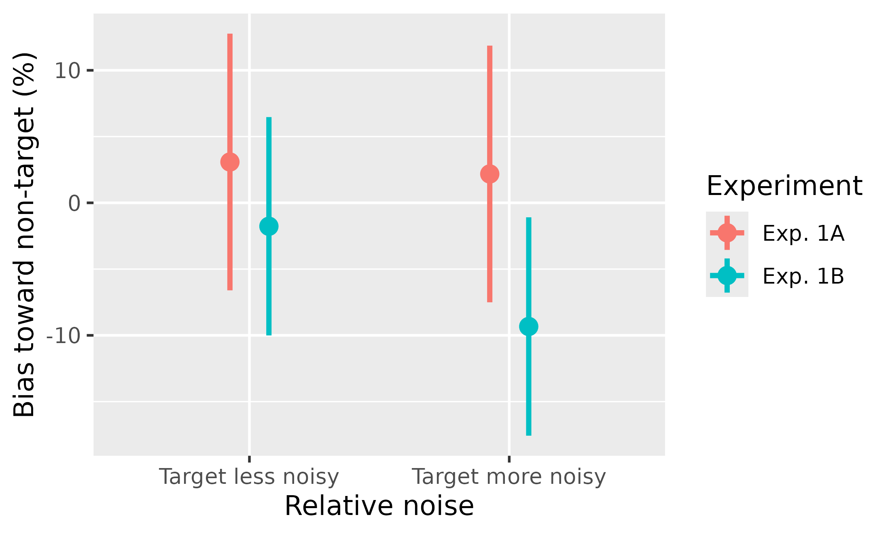

# Getting Started with apastats2

`apastats2` provides helpers for formatting statistical results in APA
style. This vignette shows a minimal workflow using base datasets and
core functions.

## Format test results

``` r

library(apastats2)
#> Loading required package: ggplot2
#> Loading required package: data.table
#> 
#> Attaching package: 'data.table'
#> The following object is masked from 'package:base':
#> 
#>     %notin%

set.seed(1)
t_res <- t.test(rnorm(20, mean = 10, sd = 2))
t_str <- apa(t_res)
t_str
#> [1] "_t_(19.0) = 25.42, _p_ < .001"
```

Inline rendering example: One-sample test result was *t*(19.0) = 25.42,
*p* \< .001.

``` r

data("sleep")
mt_str <- apa_mean_and_t(sleep$extra, sleep$group, which.mean = 3, paired = TRUE)
mt_str
#> [1] "_M_ = 0.75 [-0.18, 1.74] vs. _M_ = 2.33 [1.24, 3.54], _t_(9.0) = -4.06, _p_ = .003"
```

Inline rendering example: Sleep increase comparison was *M* = 0.75
\[-0.18, 1.74\] vs. *M* = 2.33 \[1.24, 3.54\], *t*(9.0) = -4.06, *p* =
.003.

``` r

set.seed(2)
x <- rnorm(40)
y <- 0.5 * x + rnorm(40, sd = 0.8)
cor_str <- apa(cor.test(x, y))
cor_str
#> [1] "_r_(38) = 0.41, _p_ = .009"
```

Inline rendering example: Correlation result was *r*(38) = 0.41, *p* =
.009.

``` r

tbl <- matrix(c(30, 20, 15, 35), nrow = 2, byrow = TRUE)
chi_str <- apa(chisq.test(tbl))
chi_str
#> [1] "$\\chi^2$(1, _N_ = 100) = 7.92, _p_ = .005, _V_ = .28"
```

Inline rendering example: Chi-square result was \\\chi^2\\(1, *N* = 100)
= 7.92, *p* = .005, *V* = .28.

## Format model terms

You can format selected terms from linear or generalized models.

``` r

glm_res <- glm(Freq ~ (Age + Sex) * Survived, family = poisson, data = data.frame(Titanic))
glm_str <- apa(glm_res, term = "SexFemale:SurvivedYes", dtype = 3)
glm_str
#> [1] "_B_ = 2.32, _SE_ = 0.12, _Z_ =  19.38, _p_ < .001"
```

Inline rendering example: GLM term result was *B* = 2.32, *SE* = 0.12,
*Z* = 19.38, *p* \< .001.

## Adjusted confidence intervals

[`get_adjusted_ci()`](https://achetverikov.github.io/APAstats/reference/get_adjusted_ci.md)
computes summary statistics and interval columns for between-subject,
within-subject, and mixed designs. The within-subject Cousineau-Morey
implementation is adapted from the `superb` framework, but `apastats2`
implements it internally and does not require `superb`.

``` r

data(memory_noise)

# Between-subject intervals: standard vs high-variability sample
target_higher <- memory_noise[
  memory_noise$relative_noise == "target more noisy",
]
between_ci <- get_adjusted_ci(
  target_higher,
  value_var = "bias_percent",
  between = "experiment",
  wid = "participant"
)
between_ci[, c("experiment", "descr")]
#>   experiment                      descr
#> 1    Exp. 1A  _M_ = 2.18 [-8.82, 13.18]
#> 2    Exp. 1B _M_ = -9.33 [-19.11, 0.44]

# Within-subject Cousineau-Morey intervals
within_ci <- get_adjusted_ci(
  memory_noise[memory_noise$experiment == "Exp. 1A", ],
  value_var = "bias_percent",
  within = "relative_noise",
  wid = "participant"
)
within_ci[, c("relative_noise", "descr")]
#>      relative_noise                     descr
#> 1 target less noisy _M_ = 3.08 [-6.60, 12.77]
#> 2 target more noisy _M_ = 2.18 [-7.51, 11.86]

# Mixed design
mixed_ci <- get_adjusted_ci(
  memory_noise,
  value_var = "bias_percent",
  within = "relative_noise",
  between = "experiment",
  wid = "participant"
)
mixed_ci[, c("experiment", "relative_noise", "descr")]
#>   experiment    relative_noise                       descr
#> 1    Exp. 1A target less noisy   _M_ = 3.08 [-6.60, 12.77]
#> 2    Exp. 1B target less noisy  _M_ = -1.77 [-10.01, 6.47]
#> 3    Exp. 1A target more noisy   _M_ = 2.18 [-7.51, 11.86]
#> 4    Exp. 1B target more noisy _M_ = -9.33 [-17.57, -1.09]
```

## Point-range plotting

[`plot_pointrange()`](https://achetverikov.github.io/APAstats/reference/plot_pointrange.md)
can be used directly for quick summaries.

``` r

plot_pointrange(
  memory_noise,
  aes(x = relative_noise, color = experiment, y = bias_percent),
  wid = "participant",
  within_subj = TRUE,
  withinvars = "relative_noise",
  betweenvars = "experiment",
  connecting_line = TRUE
) +
  labs(
    x = "Relative noise",
    y = "Bias toward non-target (%)",
    color = "Experiment"
  ) +
  scale_x_discrete(labels = c(
    "target less noisy" = "Target less noisy",
    "target more noisy" = "Target more noisy"
  ))
#> `geom_line()`: Each group consists of only one observation.
#> ℹ Do you need to adjust the group aesthetic?
```



## Misc helpers

``` r

round_p(c(0.025, 0.0001, 0.568))
#> [1] "= .025" "< .001" "= .568"
mean_ci_str <- apa_mean_conf(c(1.1, 1.5, 0.9, 1.8, 1.2), bootCI = FALSE)
mean_ci_str
#> [1] "_M_ = 1.30 [0.86, 1.74]"
```

Inline rendering example: Mean and CI summary was *M* = 1.30 \[0.86,
1.74\].

See individual help pages for full argument details and supported model
classes.
