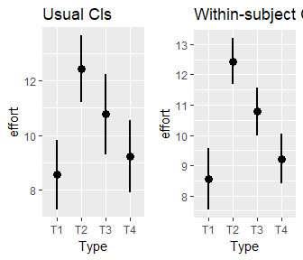
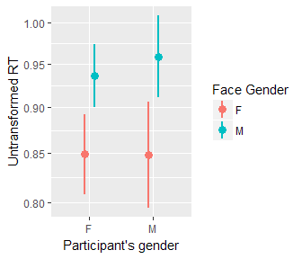
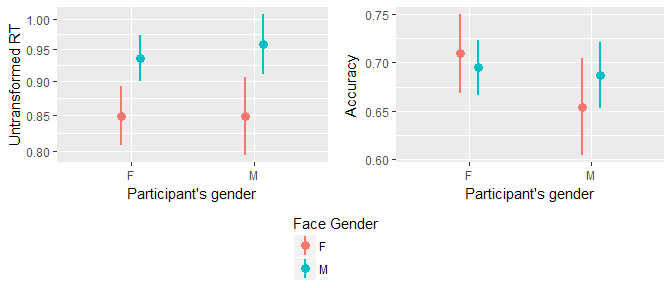

The descriptions for the results of significance testing in this file are generated automatically based on the tests results with `apastats` library.

See the Rmd file here: https://raw.githubusercontent.com/ralfer/apa_format_and_misc/master/example/example.Rmd


```r
source('../functions.R', chdir=T)
load.libs(c('data.table','knitr'))
opts_chunk$set(message=F)
```

```r
t_res<-t.test(rnorm(20, mean = 10, sd=2))

t_res
```

```
## 
## 	One Sample t-test
## 
## data:  rnorm(20, mean = 10, sd = 2)
## t = 22.0357, df = 19, p-value = 5.429e-15
## alternative hypothesis: true mean is not equal to 0
## 95 percent confidence interval:
##   9.364504 11.330147
## sample estimates:
## mean of x 
##  10.34733
```

One sample Student's t-test demonstrated that X significantly higher than zero, _t_(19.0) = 22.04, _p_ < .001.


```r
with(sleep, describe.mean.and.t( extra, group, which.mean = 3, paired=T))
```

```
## [1] "_M_ = 0.75 [-0.29, 1.91] vs. _M_ = 2.33 [1.17, 3.58], _t_(9.0) = -4.06, _p_ = .003"
```

Student's t-test showed that increase in hours of sleep compared to control was lower in group 1 than in group 2, _M_ = 0.75 [-0.22, 1.84] vs. _M_ = 2.33 [1.23, 3.48], _t_(9.0) = -4.06, _p_ = .003. 


```r
require(MASS)
glm_res<-glm(Freq ~ (Age+Sex)*Survived, family = poisson, data = data.frame(Titanic))

describe.glm(glm_res)
```

```
##                           B   SE   Stat      p                   eff
## (Intercept)            2.48 0.14  17.83 < .001           (Intercept)
## AgeAdult               3.32 0.14  23.52 < .001              AgeAdult
## SexFemale             -2.38 0.09 -25.58 < .001             SexFemale
## SurvivedYes           -0.48 0.20  -2.46 = .014           SurvivedYes
## AgeAdult:SurvivedYes  -0.88 0.20  -4.45 < .001  AgeAdult:SurvivedYes
## SexFemale:SurvivedYes  2.32 0.12  19.38 < .001 SexFemale:SurvivedYes
##                                            str
## (Intercept)            _Z_ = 17.83, _p_ < .001
## AgeAdult               _Z_ = 23.52, _p_ < .001
## SexFemale             _Z_ = -25.58, _p_ < .001
## SurvivedYes            _Z_ = -2.46, _p_ = .014
## AgeAdult:SurvivedYes   _Z_ = -4.45, _p_ < .001
## SexFemale:SurvivedYes  _Z_ = 19.38, _p_ < .001
```

```r
lm_res<-lm(Postwt ~ Prewt + Treat + offset(Prewt), anorexia)
describe.glm(lm_res)
```

```
##                 B    SE  Stat      p         eff                     str
## (Intercept) 49.77 13.39  3.72 < .001 (Intercept)  _t_ = 3.72, _p_ < .001
## Prewt       -0.57  0.16 -3.51 < .001       Prewt _t_ = -3.51, _p_ < .001
## TreatCont   -4.10  1.89 -2.16 = .034   TreatCont _t_ = -2.16, _p_ = .034
## TreatFT      4.56  2.13  2.14 = .036     TreatFT  _t_ = 2.14, _p_ = .036
```


```r
describe.glm(glm_res, "SexFemale:SurvivedYes", short=1)
```

```
## [1] "_Z_ = 19.38, _p_ < .001"
```

```r
describe.glm(glm_res, "SexFemale:SurvivedYes", short=2)
```

```
## [1] "_B_ = 2.32 (0.12), _p_ < .001"
```

```r
describe.glm(glm_res, "SexFemale:SurvivedYes", short=3)
```

```
## [1] "_B_ = 2.32, _SE_ = 0.12,  _Z_ = 19.38, _p_ < .001"
```

```r
describe.glm(glm_res, "SexFemale:SurvivedYes", short=3, test_df=T)
```

```
## [1] "_B_ = 2.32, _SE_ = 0.12,  _Z_(26) = 19.38, _p_ < .001"
```

Adults had lower chances of survival on Titanic than children, _Z_ = -4.45, _p_ < .001, and women had higher chances than men, _B_ = 2.32, _SE_ = 0.12,  _Z_ = 19.38, _p_ < .001. 


```r
require(ez)
data(ANT)

rt_anova = ezANOVA(
    data = ANT[ANT$error==0,]
    , dv = rt
    , wid = subnum
    , within = .(cue,flank)
    , between = group
)
```

```
## Warning: Collapsing data to cell means. *IF* the requested effects are a
## subset of the full design, you must use the "within_full" argument, else
## results may be inaccurate.
```

```r
rt_anova
```

```
## $ANOVA
##            Effect DFn DFd           F            p p<.05        ges
## 2           group   1  18   18.430592 4.377562e-04     * 0.07633358
## 3             cue   3  54  516.605213 1.005518e-39     * 0.89662286
## 5           flank   2  36 1350.598810 1.386546e-34     * 0.92710583
## 4       group:cue   3  54    2.553236 6.497492e-02       0.04110445
## 6     group:flank   2  36    8.768499 7.900829e-04     * 0.07627434
## 7       cue:flank   6 108    5.193357 9.938494e-05     * 0.11436699
## 8 group:cue:flank   6 108    6.377225 9.012515e-06     * 0.13686958
## 
## $`Mauchly's Test for Sphericity`
##            Effect         W         p p<.05
## 3             cue 0.7828347 0.5366835      
## 4       group:cue 0.7828347 0.5366835      
## 5           flank 0.8812738 0.3415406      
## 6     group:flank 0.8812738 0.3415406      
## 7       cue:flank 0.1737053 0.1254796      
## 8 group:cue:flank 0.1737053 0.1254796      
## 
## $`Sphericity Corrections`
##            Effect       GGe        p[GG] p[GG]<.05       HFe        p[HF]
## 3             cue 0.8652559 1.115029e-34         * 1.0239520 1.005518e-39
## 4       group:cue 0.8652559 7.472046e-02           1.0239520 6.497492e-02
## 5           flank 0.8938738 3.763312e-31         * 0.9858964 3.964046e-34
## 6     group:flank 0.8938738 1.297752e-03         * 0.9858964 8.438369e-04
## 7       cue:flank 0.6022111 1.546166e-03         * 0.7721473 4.745714e-04
## 8 group:cue:flank 0.6022111 3.424499e-04         * 0.7721473 7.170939e-05
##   p[HF]<.05
## 3         *
## 4          
## 5         *
## 6         *
## 7         *
## 8         *
```

Repeated measures ANOVA demonstrated a significant influence of cue on RT, _F_(3, 54) = 516.61, _p_ < .001, $\eta$^2^~G~ = 0.897. 

### Plotting pointrange plots

You can plot within-subject CIs with the help of summarySEwithin from http://www.cookbook-r.com/Graphs/Plotting_means_and_error_bars_%28ggplot2%29/


```r
require(nlme)
require(gridExtra)

data(ergoStool)

p1<-plot.pointrange(ergoStool, aes(x=Type, y=effort))+ggtitle('Usual CIs')
p2<-plot.pointrange(ergoStool, aes(x=Type, y=effort), within_subj=T, wid='Subject')+ggtitle('Within-subject CIs')
grid.arrange(p1, p2, ncol=2)
```

 

### Showing log-transformed data back untransformed

Sometimes it is useful to analyze data log-transformed (e.g., in reaction time analyses), but to show it untransformed. _scale_y_exp_ comes in handy.


```r
temp <- tempfile()
download.file("http://cogjournal.org/2/1/files/ChetverikovRJCS2015SOMdata.zip",temp)
faces <- data.table(read.csv(unz(temp, "faces_data.csv"), header = T))
unlink(temp)

faces[,logAT:=log(answerTime)]
```

```
##       uid sid stim_gender user_gender correct answerTime      logAT
##    1:   1  33           M           F       1      0.610 -0.4942963
##    2:   1  88           M           F       0      2.251  0.8113746
##    3:   1  43           M           F       0      1.969  0.6775258
##    4:   1  52           M           F       1      1.063  0.0610951
##    5:   1  72           M           F       0      1.376  0.3191807
##   ---                                                              
## 2576:  60  13           M           F       1      0.504 -0.6851790
## 2577:  60  39           M           F       1      0.450 -0.7985077
## 2578:  60  41           F           F       1      0.462 -0.7721904
## 2579:  60  87           M           F       1      1.133  0.1248690
## 2580:  60  84           M           F       1      0.732 -0.3119748
```

```r
p0<-plot.pointrange(faces[correct==1, ], aes(x=user_gender, color=stim_gender, y=logAT), wid='uid')+ylab('Log RT')

p0
```

 

```r
p1<-plot.pointrange(faces[correct==1, ], aes(x=user_gender, color=stim_gender, y=logAT), wid='uid')+scale_y_exp(digits=2)+labs(x="Participant's gender", color="Face Gender", y='Untransformed RT')

p1
```

 

### Sharing legend and axis title between plots

It is not very easy to share legend or axis title between plots. I modified a function from https://github.com/hadley/ggplot2/wiki/Share-a-legend-between-two-ggplot2-graphs to make it easier. 


```r
p2<-plot.pointrange(faces, aes(x=user_gender, color=stim_gender, y=correct), wid='uid')+labs(x="Participant's gender", color="Face Gender" ,y='Accuracy')

p2
```

 

```r
grid_arrange_shared_legend(p1 + theme(legend.direction="horizontal"),p2)
```

 

```r
grid_arrange_shared_legend(p1, p2, stack = 'horizontal')
```

 

```r
grid_arrange_shared_legend(p1, p2, stack = 'horizontal', one_sub = T)
```

 
